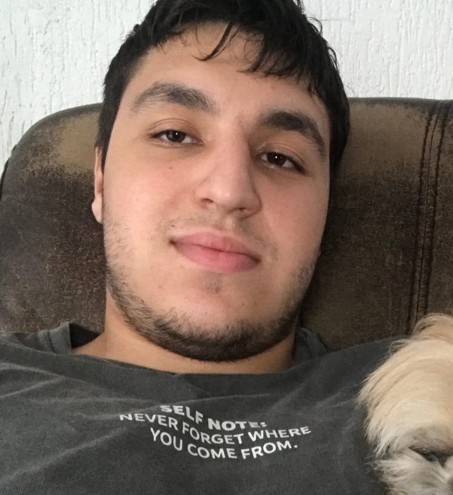
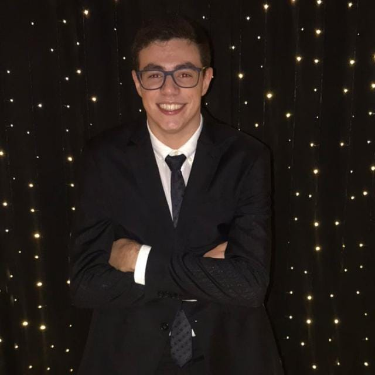
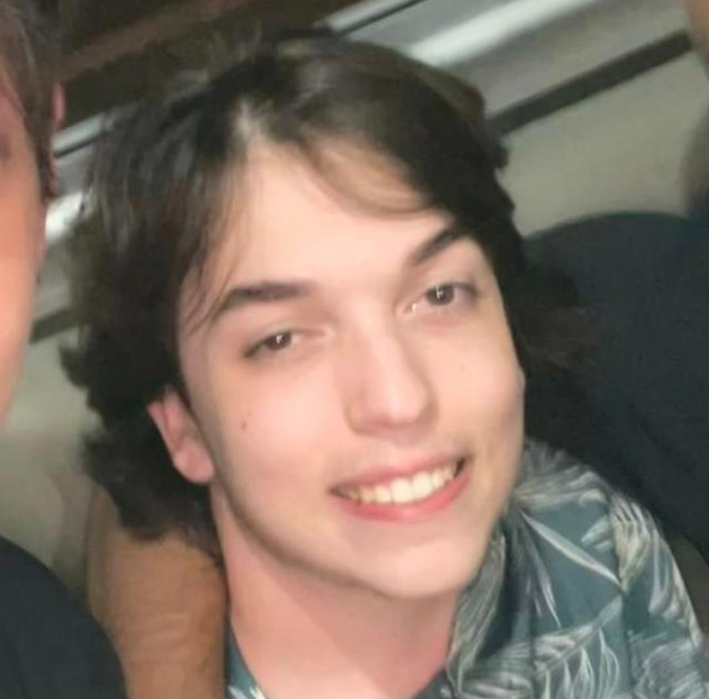

## **FluidosBons-2025.1**

  

## 📅 Desenvolvimento Ágil - 2025.1
## 👨‍💻 Equipe:

  

     
    <strong>Victor Fares</strong> 
    <a href="https://github.com/victorfares" target="_blank">GitHub</a>
  

 

     
    <strong>Gabriel Scarduelli</strong> 
    <a href="https://github.com/BielScard" target="_blank">GitHub</a>
  

  

     
    <strong>Gabriel Almeida</strong> 
    <a href="https://github.com/almeidaaaaaaaa" target="_blank">GitHub</a>
  

  

     
    <strong>Gabriel Macolla</strong> 
    <a href="https://github.com/GabrielMacolla" target="_blank">GitHub</a>
  

  

     
    <strong>João Maggi</strong> 
    <a href="https://github.com/joaomaggi03" target="_blank">GitHub</a>
  

## 1. Visão Geral do Sistema

A landing page do projeto "Bons Fluidos" tem como objetivo apresentar de forma clara, visual e acessível as principais informações sobre o projeto de extensão da UTFPR-CP. 

Ela será uma página inicial pública, voltada para o público geral, interessados em conhecer a iniciativa, sua missão, objetivos, atividades realizadas e formas de contato. A página incluirá seções como "Sobre o projeto", imagens ilustrativas, descrição das ações promovidas, além de dados para contato e links para redes sociais oficiais.

O design será responsivo, garantindo uma boa experiência tanto em dispositivos móveis quanto em desktops, e seguirá a identidade visual do projeto.

